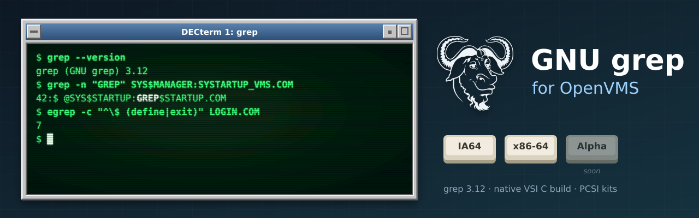

<p align="center">
  
</p>

# GNU grep for OpenVMS

A port of current GNU grep to OpenVMS on **IA64** and **x86-64**, kept as a thin layer over the
official GNU release so that it can follow upstream releases with minimal effort. VSI's GNV kit
ships a grep that is many releases behind; this port starts from **GNU grep 3.12**. It belongs to
the same family as [GNU sed](https://github.com/issinoho/vms-sed),
[GNU awk](https://github.com/issinoho/vms-awk), [GNU make](https://github.com/issinoho/vms-make),
[GNU diffutils](https://github.com/issinoho/vms-diffutils),
[GNU patch](https://github.com/issinoho/vms-patch), [GNU m4](https://github.com/issinoho/vms-m4),
[GNU Bison](https://github.com/issinoho/vms-bison), [flex](https://github.com/issinoho/vms-flex),
[GNU Wget](https://github.com/issinoho/vms-wget), [curl](https://github.com/issinoho/vms-curl),
[PCRE2](https://github.com/issinoho/vms-pcre2), [zlib](https://github.com/issinoho/vms-zlib),
[GNU gzip](https://github.com/issinoho/vms-gzip), [GNU tar](https://github.com/issinoho/vms-tar),
[bzip2](https://github.com/issinoho/vms-bzip2), [XZ Utils](https://github.com/issinoho/vms-xz),
[Zstandard](https://github.com/issinoho/vms-zstd),
[MariaDB](https://github.com/issinoho/vms-mariadb),
[lighttpd](https://github.com/issinoho/vms-lighttpd)
and [fastfetch](https://github.com/issinoho/vms-fastfetch) for OpenVMS.

This repository holds **only our changes**. Upstream source is never stored here: every
build starts from the signed release tarball, applies our patches, adds our VMS-only
files, and generates the configuration for VSI C.

## Status

| | IA64 (OpenVMS V8.4-2L3, VSI C 7.4) | x86-64 (OpenVMS E9.2-4, VSI C 7.7) |
|---|---|---|
| Builds with MMS | yes | yes |
| DCL smoke test | 20/20 | 20/20 |
| Regex tables (BRE, ERE, Spencer) | 330/330 | 330/330 |
| Upstream test suite (128 tests) | not runnable (GNV too old) | 96 pass, 0 unexpected failures |
| `grep -P` (PCRE2 10.49, [vms-pcre2](https://github.com/issinoho/vms-pcre2)) | yes | yes |
| PCSI kit ([v3.12-vms3](https://github.com/issinoho/vms-grep/releases/tag/v3.12-vms3)) | `ISSINOHO-I64VMS-GREP-V0312-3-1.PCSI` | `ISSINOHO-X86VMS-GREP-V0312-3-1.PCSI` |

See [docs/TESTING.md](docs/TESTING.md) for the details of every skipped, excluded and
expected-to-fail test.

## Installing the kit

Download the kits from the
[latest release](https://github.com/issinoho/vms-grep/releases/latest); the current
release is [v3.12-vms3](https://github.com/issinoho/vms-grep/releases/tag/v3.12-vms3).
Check them against the release's `SHA256SUMS`. The kits are PCSI files, named
`ISSINOHO-<base>-GREP-V0312-3-1.PCSI` (grep 3.12, VMS patch level 3). `<base>` is `I64VMS`
or `X86VMS`. A kit downloaded through a non-VMS system arrives without its record format,
so restore that first, then install it:

```
$ SET FILE/ATTRIBUTE=(RFM:FIX,LRL:8192,MRS:8192,RAT:NONE) ISSINOHO-*-GREP-V0312-3-1.PCSI
$ PRODUCT INSTALL GREP /PRODUCER=ISSINOHO /SOURCE=dev:[dir]
```

The kits have been tested by installing, verifying and removing them on both architectures.
`GREP.EXE` is self-contained: PCRE2 is linked in, so nothing else needs installing for
`grep -P`. The kits are not signed, so PCSI notes that it cannot validate a signature. It installs
`[GREP.BIN]GREP.EXE`, the documentation in `[GREP.DOC]` (`README.VMS`, a plain-text
manual `GREP.TXT`, `GREP.1`, `NEWS`, `COPYING`) and two procedures:

- `SYS$STARTUP:GREP$STARTUP.COM` defines `GREP$ROOT`. It runs once at installation and
  prints the post-installation tasks. To run it at every boot, add
  `$ @SYS$STARTUP:GREP$STARTUP.COM` to `SYS$MANAGER:SYSTARTUP_VMS.COM`.
- `[GREP]GREP$SETUP.COM` defines `grep`, `egrep` and `fgrep` for a user (add it to
  `LOGIN.COM`): `$ @GREP$ROOT:[000000]GREP$SETUP.COM`.

Removing the product (`PRODUCT REMOVE GREP`) deassigns `GREP$ROOT`.

## Using grep on OpenVMS

These notes are for people running the resulting `GREP.EXE`:

- **Defining the command:** define it as a foreign command, `$ grep :== $dev:[dir]GREP.EXE`,
  or put the directory in `DCL$PATH`.
- **Case of options and patterns:** under the default `PARSE_STYLE=TRADITIONAL`, DCL
  upper-cases the command line and the C runtime then lower-cases it, so `grep -E Foo`
  arrives as `grep -e foo`. Use `$ SET PROCESS/PARSE_STYLE=EXTENDED` (grep then preserves
  case), or quote the arguments: `grep "-E" "Foo"`.
- **Exit status:** grep returns POSIX exit codes (0 = match, 1 = no match, 2 = error),
  encoded in `$STATUS` as C-facility values. In DCL, `($STATUS .AND. %X7F8) / 8` gives the
  code.
- **`grep -P`:** Perl-compatible regular expressions use PCRE2 10.49 (8-bit, Unicode, no
  JIT). Quote the option and the pattern under traditional parsing, for example
  `grep "-P" "\d+" file.txt`. `grep --version` names the PCRE2 version.
- **Capturing grep's output:** reading grep's output from another program (Perl backticks,
  pipes) works as on Unix; patch 0010 fixed a case where it came back empty.
- **File names:** these are reported in Unix form (`dir/file.txt`). `-r` recurses through
  directories.
- **Locales:** set a locale with a logical name or an environment variable, for example
  `$ DEFINE LC_ALL "UTF8-20"`, or `LC_ALL=ja_JP.UTF-8` under GNV bash. VMS has no
  `en_US.UTF-8`; use the generic `UTF8-xx` locales. IA64 ships only `UTF8-20`
  (at most 3-byte characters).
- **Overriding the C runtime switches:** grep sets several of these at start-up (Unix file
  names, case preservation, …; see `overlay/vms/vms_crtl_init.c`). Defining the
  corresponding `DECC$` logical name yourself overrides grep's choice.

## Repository layout

```
upstream.conf          upstream version, tarball URL, SHA-256, signing key
patches/               unified diffs against the upstream tree, applied in order (series)
overlay/               new files only, copied into the tree (never replaces upstream files)
  vms/                 DESCRIP.MMS, BUILD.COM, VMS C sources, test procedures
  vms/config/          configure answers for VSI C (generated + hand-settled), compiler flags
tools/                 host-side scripts: fetch, prepare, push, configure, build, test
snapshot/              resolved config.h, source lists, every configure answer (reviewed)
probes/                raw logs of the VMS function/header probes
docs/                  plan, VMS environment findings, testing
cache/ staging/ out/   generated locally, not committed
```

## Patches

| Patch | Purpose |
|---|---|
| 0001 | `assert.h`: redefine `assert` on each inclusion. The CRTL header is include-guarded. |
| 0002 | `getprogname`: VMS implementation using `JPI$_IMAGNAME`. |
| 0003 | `open`: the CRTL cannot `open()` a directory (ENOENT); use gnulib's dummy-descriptor fallback. Makes `-r` work. |
| 0004 | tests: no `tr()` shell function on VMS (GNV bash mangles function arguments in pipelines). |
| 0005 | tests: finite producers instead of `yes \| head` (no SIGPIPE on VMS pipes). |
| 0006 | grep: also take `LC_ALL`/`LC_*`/`LANG` from environment variables (the CRTL reads only logical names). |
| 0007 | `mbrtowc`: correct the CRTL's UTF-8 decoding (accepts surrogates, rejects U+10FFFF). |
| 0008 | tests: a whole-second `timeout` capability check on VMS. |
| 0009 | grep: write output with `putc` on VMS. For record-oriented stdout (terminal, log file, mailbox) the CRTL turns each `fwrite` item into a record, so lines came out one character per line. |
| 0010 | grep: on VMS, check the device name before treating stdout as `/dev/null`. When Perl or another program captured grep's output, the mailbox looked like `/dev/null` to `fstat`, and grep printed nothing. |

Patches 0004, 0005 and 0008 change only the test suite.

## How to build

The build has two halves. A **Linux host** prepares a ready-to-compile source tree from
the GNU release, and an **OpenVMS system** compiles it with VSI C and MMS. The scripts in
`tools/` can drive the VMS side over ssh. The prepared tree is self-contained, though, so
you can also copy it to VMS any way you like and build there by hand.

### What you need

- **Linux host:** git, bash, python3, gcc and make (for the host-side `configure` run),
  curl and gpg. ssh/sftp too, if you want the automated route.
- **OpenVMS IA64 or x86-64:** VSI C and MMS. OpenSSH for the automated route. VSI Perl for
  the regex tests, and GNV (bash 4.4 and coreutils, x86-64) for the full upstream suite.
  The build has been tested on IA64 V8.4-2L3 with VSI C 7.4, and on x86-64 E9.2-4 with
  VSI C 7.7.

### 0. Build PCRE2 first

`grep -P` uses PCRE2, linked statically into `GREP.EXE`. Build
[vms-pcre2](https://github.com/issinoho/vms-pcre2) first; its README explains how.
On each VMS system this produces an install tree such as
`[.PCRE2-10_49.INSTALL_IA64]`. The grep build finds it through the rooted logical name
`PCRE2$ROOT`:
- **Using the PCRE2 kit:** if the [PCRE2 PCSI kit](https://github.com/issinoho/vms-pcre2/releases/latest)
  is installed, `PCRE2$ROOT` is already defined system-wide, and a hand build can use it as is.
- **Building by hand:** define it yourself, e.g.
  `$ DEFINE/TRANSLATION=CONCEALED PCRE2$ROOT dev:[dir.PCRE2-10_49.INSTALL_IA64.]`.
- **Building over ssh:** `tools/build.sh` defines it for the tree named by `PCRE2_TREE` in
  `upstream.conf`, in the same work directory.

### 1. Prepare the source tree (Linux)

```sh
git clone https://github.com/issinoho/vms-grep.git
cd vms-grep
tools/prepare.sh
```

This downloads the grep release named in `upstream.conf`, and checks its SHA-256 and GPG
signature against the GNU keyring. It then applies `patches/`, adds `overlay/`, generates
`config.h`, the gnulib headers and the MMS source list, and leaves the result in
`staging/grep-3.12/`.

### 2a. Build on VMS by hand

Copy these parts of `staging/grep-3.12/` to a directory on the VMS system, keeping the
directory structure: `config.h`, `lib/`, `src/` and `vms/` (`tests/` too, for the test
suites). Any method works: sftp, a ZIP made on the host, or NFS. Then, on VMS, with
`PCRE2$ROOT` defined (step 0):

```
$ SET DEFAULT dev:[dir.GREP-3_12]
$ @[.VMS]BUILD                    ! -> [.BIN_IA64]GREP.EXE or [.BIN_X86_64]GREP.EXE
$ @[.VMS]TEST_SMOKE               ! quick functional test (20 checks, incl. -P)
$ @[.VMS]REGEX_TESTS              ! regex tables, if VSI Perl is installed
$ @[.VMS.KIT]MAKE_KIT             ! PCSI kit -> [.KIT_<arch>]
```

`@[.VMS]BUILD ALL KEEP_GOING` carries on past compile errors so that one run reports them
all. `@[.VMS]BUILD CLEAN` removes the objects; do that after changing compiler flags,
because MMS doesn't track them.

### 2b. Build on VMS from the host over ssh

One-time setup:

1. Create an ssh key with no passphrase, e.g. `~/.ssh/vms_ed25519` (or point `VMS_SSH_KEY`
   at another key). Install its public key in `SYS$LOGIN:[.SSH]AUTHORIZED_KEYS.` on each
   node. The login directory must not be group- or world-writable, or sshd ignores the key.
2. Copy `tools/nodes.conf.example` to `tools/nodes.conf` and fill in each node: host,
   port, user, VMS work directory and the matching sftp path. This file is git-ignored.
3. Create the work directory on each node, e.g.
   `$ CREATE/DIRECTORY DISK$USER:[USERNAME.VMS_GREP]`.
4. Check access: `tools/vms.sh ia64 dcl 'show time'`.

Then, from the host:

```sh
tools/build.sh ia64         # upload changed files, MMS build on the node
tools/test.sh ia64          # DCL smoke test
tools/gnvtest.sh x86        # full upstream test suite under GNV (about 90 minutes)
tools/kit.sh ia64           # build, then make the PCSI kit -> out/kits/
```

The names (`ia64`, `x86`) are the node names from `tools/nodes.conf`. `tools/push.sh`
uploads only files whose content changed, so rebuilds are incremental.

### 3. Install

See [Installing the kit](#installing-the-kit). To try the image without a kit, define a
foreign command: `$ grep :== $dev:[dir.GREP-3_12.BIN_IA64]GREP.EXE`.

## Tools

| Script | What it does |
|---|---|
| `tools/fetch.sh` | Downloads the tarball and verifies its SHA-256 and GPG signature (GNU keyring). |
| `tools/prepare.sh` | Builds `staging/<name>-<version>`: patches, overlay, offline `configure`, headers, MMS rules, snapshot. |
| `tools/push.sh <node>` | Uploads the prepared tree (changed files only). |
| `tools/build.sh <node> [target] [KEEP_GOING]` | Pushes, then runs `[.VMS]BUILD.COM`. |
| `tools/test.sh <node>` | Runs `[.VMS]TEST_SMOKE.COM`. |
| `tools/gnvtest.sh <node> [test...]` | Runs the upstream suite in batch and fetches results to `out/gnvtests-<node>/`. |
| `tools/kit.sh <node>` | Builds, then makes the PCSI kit on the node (`[.VMS.KIT]MAKE_KIT.COM`) and fetches it to `out/kits/`. |
| `tools/installcheck.sh <node>` | Installs the kit on the node, verifies it, runs the smoke test on the installed image and removes it. Changes the system while it runs. |
| `tools/vms_configure.sh <node>` | Runs upstream `configure` with VSI C on the node as the compiler (once per release). |
| `tools/vms.sh <node> dcl\|run\|batch\|put\|get …` | Reliable remote execution and file transfer (see below). |

`tools/vms.sh` exists because output from `ssh host <command>` is unreliable on these
systems, and sessions sometimes never close. Every remote step writes a log and a
completion marker, which are fetched with sftp.

## How configuration works

GNU `configure` cannot run usefully on VMS, so it runs on the Linux host with VMS answers:

1. `tools/vms_configure.sh <node>` runs upstream `configure` in cross mode with
   `tools/vmscc` as the compiler. Every compile, link and preprocessor test is sent to
   `vms_ccserver.com` on the node and judged by VSI C; results are memoised by content
   hash. It takes 50–70 minutes, once per upstream release, and writes
   `overlay/vms/config/configure-<node>.cache` (committed). The IA64 and x86-64 answers are
   identical apart from the CPU name.
2. `overlay/vms/config/vms-manual.site` holds hand-settled answers, each with a reason:
   run-time behaviour that cross mode cannot test, and CRTL quirks.
3. `overlay/vms/config/next-headers.site` (generated) maps gnulib's wrapper headers to
   CRTL text-library modules. VSI C has no `#include_next`, so gnulib's `lib/stdio.h` uses
   `#include STDIO`, which VSI C reads from `SYS$LIBRARY:DECC$RTLDEF.TLB`.
4. `tools/prepare.sh` replays these answers through the host `configure` offline. It
   generates `config.h`, the gnulib headers and `vms/sources.mms`, and records the result
   in `snapshot/`. Review `git diff -- snapshot` whenever it changes.

## Moving to a new upstream release

1. Update `upstream.conf` (version, URL, SHA-256).
2. Run `tools/prepare.sh`. Patch rejects are the first to-do list; refresh the affected patches.
3. Run `tools/vms_configure.sh ia64` (and `x86`) to refresh the answers, and compare the two
   cache files.
4. Run `tools/prepare.sh` again, then review `git diff -- snapshot`.
5. Build and test on both nodes (smoke test, regex tables, `tools/gnvtest.sh x86`), then fix
   anything new with a patch or an overlay file.

## Layout of a prepared tree on VMS

```
[.GREP-3_12]                config.h, lib/, src/, tests/, vms/
[.GREP-3_12.VMS]            BUILD.COM, DESCRIP.MMS, SOURCES.MMS, test procedures, VMS sources
[.GREP-3_12.OBJ_<arch>]     grep objects, GREPUTILS.OLB, link map
[.GREP-3_12.OBJ_<arch>.LIB] gnulib objects
[.GREP-3_12.BIN_<arch>]     GREP.EXE
[.GREP-3_12.KIT_<arch>]     the PCSI kit (MAKE_KIT.COM)
```

## Roadmap

1. A port to OpenVMS **Alpha**, alongside IA64 and x86-64.
2. VMS-specific behaviour: native record formats (VAR/VFC files), wildcard file
   specifications typed at DCL, and a review of the compiler's warnings.
3. Bring in vms-sed's fix for the C run-time library's UTF-8 decoding (sed patch 0012).
4. Offer the patches that are not VMS packaging to grep and gnulib.

The family of ports, all for IA64 and x86-64 (MariaDB: x86-64 only), each following its upstream releases:

| Port | Latest release | |
|---|---|---|
| **GNU grep** (this port) — [vms-grep](https://github.com/issinoho/vms-grep) | [v3.12-vms3](https://github.com/issinoho/vms-grep/releases/tag/v3.12-vms3) | with `grep -P` through PCRE2 |
| PCRE2 — [vms-pcre2](https://github.com/issinoho/vms-pcre2) | [v10.49-vms1](https://github.com/issinoho/vms-pcre2/releases/tag/v10.49-vms1) | the regular-expression library |
| GNU sed — [vms-sed](https://github.com/issinoho/vms-sed) | [v4.10-vms1](https://github.com/issinoho/vms-sed/releases/tag/v4.10-vms1) | the stream editor |
| GNU awk (gawk) — [vms-awk](https://github.com/issinoho/vms-awk) | [v5.4.1-vms1](https://github.com/issinoho/vms-awk/releases/tag/v5.4.1-vms1) | built with gawk's own VMS port |
| zlib — [vms-zlib](https://github.com/issinoho/vms-zlib) | [v1.3.2-vms1](https://github.com/issinoho/vms-zlib/releases/tag/v1.3.2-vms1) | the compression library |
| GNU gzip — [vms-gzip](https://github.com/issinoho/vms-gzip) | [v1.15-vms1](https://github.com/issinoho/vms-gzip/releases/tag/v1.15-vms1) | gzip, gunzip and zcat |
| GNU tar — [vms-tar](https://github.com/issinoho/vms-tar) | [v1.35-vms1](https://github.com/issinoho/vms-tar/releases/tag/v1.35-vms1) | `-z`/`-j`/`-J`/`--zstd` through the compressor kits; VMS names as Unix members |
| bzip2 — [vms-bzip2](https://github.com/issinoho/vms-bzip2) | [v1.0.8-vms1](https://github.com/issinoho/vms-bzip2/releases/tag/v1.0.8-vms1) | the bzip2 compressor and libbz2 |
| XZ Utils — [vms-xz](https://github.com/issinoho/vms-xz) | [v5.8.4-vms1](https://github.com/issinoho/vms-xz/releases/tag/v5.8.4-vms1) | xz and liblzma |
| Zstandard — [vms-zstd](https://github.com/issinoho/vms-zstd) | [v1.5.7-vms1](https://github.com/issinoho/vms-zstd/releases/tag/v1.5.7-vms1) | zstd and libzstd |
| curl — [vms-curl](https://github.com/issinoho/vms-curl) | [v8.22.0-vms2](https://github.com/issinoho/vms-curl/releases/tag/v8.22.0-vms2) | alongside VSI's curl kit, following curl's own releases |
| GNU Wget — [vms-wget](https://github.com/issinoho/vms-wget) | [v1.25.0-vms2](https://github.com/issinoho/vms-wget/releases/tag/v1.25.0-vms2) | the web retriever |
| GNU m4 — [vms-m4](https://github.com/issinoho/vms-m4) | [v1.4.21-vms1](https://github.com/issinoho/vms-m4/releases/tag/v1.4.21-vms1) | the macro processor |
| GNU Bison — [vms-bison](https://github.com/issinoho/vms-bison) | [v3.8.2-vms2](https://github.com/issinoho/vms-bison/releases/tag/v3.8.2-vms2) | the parser generator; runs GNU m4 |
| flex — [vms-flex](https://github.com/issinoho/vms-flex) | [v2.6.4-vms1](https://github.com/issinoho/vms-flex/releases/tag/v2.6.4-vms1) | the scanner generator; runs GNU m4 |
| GNU make — [vms-make](https://github.com/issinoho/vms-make) | [v4.4.1-vms1](https://github.com/issinoho/vms-make/releases/tag/v4.4.1-vms1) | built with make's own VMS port |
| GNU diffutils — [vms-diffutils](https://github.com/issinoho/vms-diffutils) | [v3.12-vms1](https://github.com/issinoho/vms-diffutils/releases/tag/v3.12-vms1) | cmp, diff, diff3, sdiff |
| GNU patch — [vms-patch](https://github.com/issinoho/vms-patch) | [v2.8-vms1](https://github.com/issinoho/vms-patch/releases/tag/v2.8-vms1) | applies diffs |
| fastfetch — [vms-fastfetch](https://github.com/issinoho/vms-fastfetch) | [v0.2.1](https://github.com/issinoho/vms-fastfetch/releases/tag/v0.2.1) | the system banner; a C99 rewrite, not a port |
| MariaDB — [vms-mariadb](https://github.com/issinoho/vms-mariadb) | [v11.4.13-vms2](https://github.com/issinoho/vms-mariadb/releases/tag/v11.4.13-vms2) | server and clients; x86-64 only, preview |
| lighttpd — [vms-lighttpd](https://github.com/issinoho/vms-lighttpd) | [v1.4.85-vms2](https://github.com/issinoho/vms-lighttpd/releases/tag/v1.4.85-vms2) | web server: HTTPS, HTTP/2, PHP over FastCGI; preview |

## Further reading

- [docs/PLAN.md](docs/PLAN.md): the overall plan and decisions.
- [docs/vms-environment.md](docs/vms-environment.md): toolchain, CRTL and GNV findings, and
  operational quirks of the nodes.
- [docs/TESTING.md](docs/TESTING.md): the test layers, results and every exception with
  its reason.

## Web site

[openvms.issinoho.com](https://openvms.issinoho.com) is the home page for all the vms-*
ports. Its source is in `site/` and `.github/workflows/pages.yml` publishes it to GitHub
Pages. The ports are listed in `site/projects.json`; add a new port there. Release details
come from each repository's latest GitHub release. The workflow takes a snapshot
(`tools/site-releases.sh`) when it deploys, every six hours, and when a `release-published`
repository dispatch arrives. The page then checks the GitHub API itself, so a new release
appears without waiting for a redeploy.

## Upstream releases

`.github/workflows/upstream-watch.yml` runs `tools/upstream_watch.py` every Monday, and by hand
from the Actions tab, optionally as a dry run. For each port in `tools/upstream-watch.json` it
compares the version the port is built from with the newest stable release on
[release-monitoring.org](https://release-monitoring.org):

- **The port's version** is `UPSTREAM_VERSION` in its `upstream.conf`; for vms-fastfetch,
  `FF_UPSTREAM_VERSION`.
- **Upstream's version** is limited to one release series where a port follows one (`track`:
  MariaDB 11.4, lighttpd 1.4).
- **When upstream is newer,** an issue labelled `upstream` opens here, titled
  `[vms-x] name N released (we ship M)`, with a checklist. If upstream moves again, the issue is
  updated. Once the port ships that version, the issue closes itself.

The issues live in this repository because the workflow's own token can write only here. To add a
port, add its repository and release-monitoring.org project id to `tools/upstream-watch.json`.

## Artwork

`docs/images/banner.svg` and `docs/images/icon.svg` were made for this project in the style of
classic DECwindows and VT terminals. They incorporate the
[GNU head](https://www.gnu.org/graphics/heckert_gnu.html) by Aurelio A. Heckert, © 2003 Free
Software Foundation, Inc., used under the Creative Commons Attribution-ShareAlike 2.0 licence.
The two images are therefore also licensed under
[CC BY-SA 2.0](https://creativecommons.org/licenses/by-sa/2.0/).

OpenVMS is a trademark of VMS Software, Inc. This project is not affiliated with VMS
Software, Inc., with the Free Software Foundation or with the GNU Project.

## Licence

GNU grep and gnulib are licensed under the GNU General Public License, version 3 or later.
The patches and the VMS build files in this repository are distributed under the same
terms; see `COPYING`.
